# MySTL

### This repo will accomplish some Simple STL Container, Algorithm and Iterator， Fuction object
[Reference](https://blog.csdn.net/TowerOs/article/details/103957395)
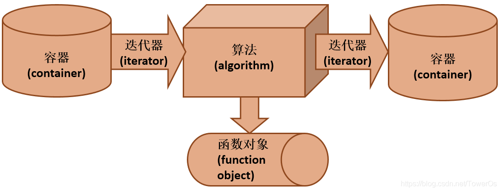
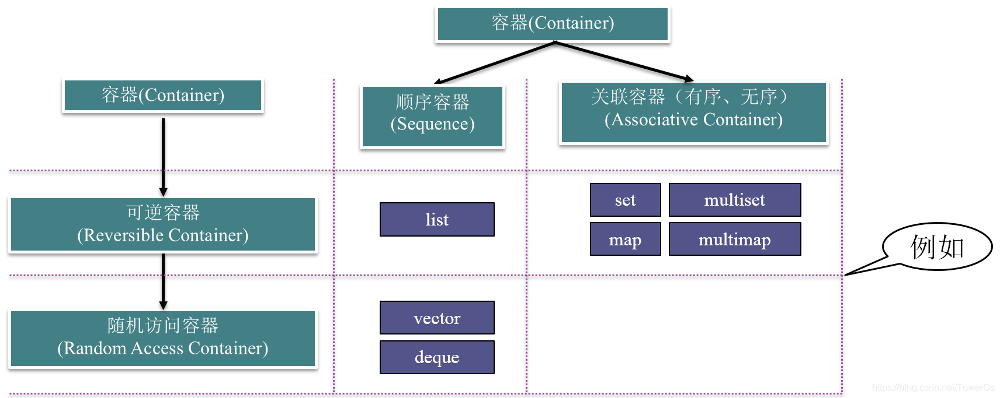

#### Container
#### Vector
</br>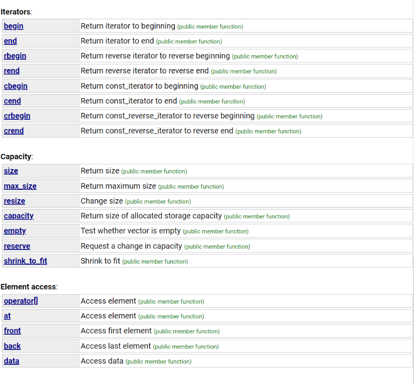<br/>
* 3/1/2023
- [x] construct function of the vector
- [x] deconstruct function of the vector
- [x] copy construct function of the vector
- [x] member function: push_back
<br/> the improvement of the push_back: </br>
Cumulative increase time complexity O(n) 
<br/>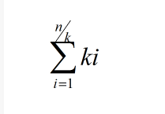</br>
<br/> Multiply increase time complexity O(1)</br>
<br/> 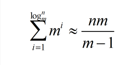 </br>
<br/> **my imporvemnet:** <br/>
<br/>the origin way to expansion is toExpanding the capacity by 2 times will cause the memory requested next time to be greater than the sum of the previously allocated memory, causing the previously allocated memory to no longer be used, so it is best to set the doubling growth factor between (1,2).
 I seted the 1.5 times of vector in my poject.<br/>

*  3/2/2023
- [x] test push_back the result and capacity as below it works :grin:
<br/>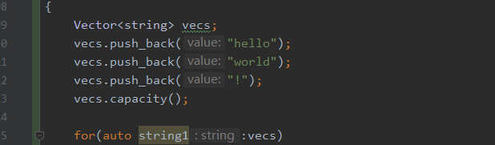</br>
<br/>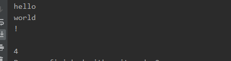</br>
***
###### small issue:
Overflow Stack:
when i set the 1.5 times to expend the capacity, the Overflow stack happend, I think when I push the one new character it did not expand the enough stack memory for the new item, so I change the 2 times memory for using.
***
**Member Function**
- [x] pop_back()
- [x] size()
- [x] capacity() 
- [x] front() 
- [x] end()
- [x] insert(iterator *it, value), 
- [x] erase(iterator *it)
- [x] back()
***
###### improve space:
Without getting rid of the dependence on std, the iterator still relies on std, and the algorithm still relies on the stl "algorithm" library, the plan of
further work:
1. continue the container including <string, map, under_ordered_map, maybe create a new container "Tree" :black_nib:>
2. finish the basic algorithm including <sort, compare etc> 
3. create document and measure structure
***


#### String
</br>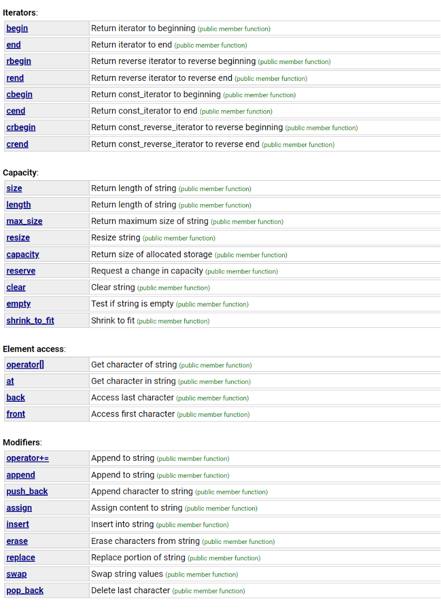<br/>
3/3/2023
- [x] construct
- [x] destruct
- [x] copy constrcut
- [x] size()
- [x] length()
- [x] max_size()

3/4/2023
- [x] compare(s1, s2, **n)
- [x] copy(char_type *container, const char_type *src, ::size_t)
- [x] begin()
- [x] end()
- [x] operator "=="
- [x] operator "[]"

```c++
class MyClass {
public:
    static int count; // 静态成员变量
    static void printCount() { // 静态成员函数
        std::cout << "Count is: " << count << std::endl;
    }
};

int MyClass::count = 0; // 静态成员变量初始化

int main() {
    MyClass::count++; // 访问静态成员变量
    MyClass::printCount(); // 调用静态成员函数
    return 0;
}

///在这个例子中，MyClass 类有一个静态成员变量 count，它在程序启动时被初始化为0。该类还有一个静态成员函数 printCount()，该函数可以通过类名调用，而不需要创建类的实例。在 main() 函数中，我们通过 MyClass::count 访问静态成员变量，并通过 MyClass::printCount() 调用静态成员函数。由于静态成员与类的实例无关，因此我们无需创建任何 MyClass 的对象即可访问和操作静态成员。
```
1. [x] test empty the result and capacity as below it works:
<br/>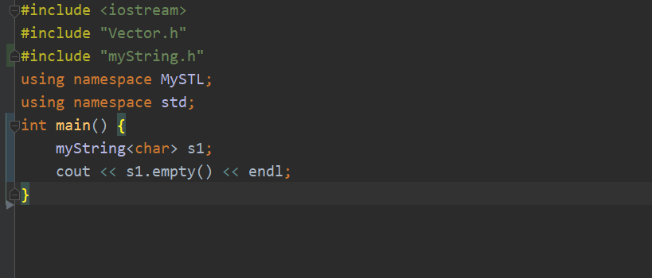</br>
<br/>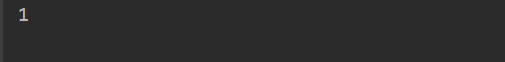</br>
3/5/2023
2. [x] operator "[]"
3/10/2023
3. [x] operator "=="
4. [x] operator "+"
5. [x] operator "+="
6. [x] Element access:reserve
7. [x] String operations:c_str()
8. [x] restruct the Construct function, destruct, copy construct
9. [x] test "=" "+" "+=" "size"
  <br/>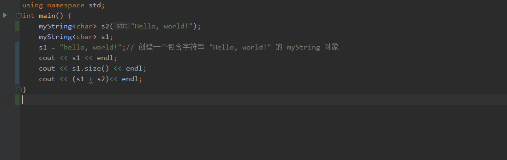</br>
  <br/>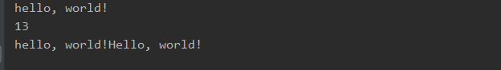</br>
3/11/2023
10. [x] restruct the nonsense part of previous part
* avoid namespace pollution
* add the initiation on the previous work
11. [x] [init the iterator of the unordered_map](Src/Container/unorderedMap.cpp)
12. [x] [create the struct of the unordered_map](Src/Container/unorderedMap.cpp)
</br>The main idea to create the container:
13. [x] This constructor allocates bucket_count buckets to the data when creating unordered_map, and stores them in a std::vector<std::list<value_type>> container. std::list<value_type> is one, linked list hash collision. Because each plate is a linked list, the more the number of plates, the fewer elements in the hash table, which means querying, inserting fast hooks and deleting elements.

