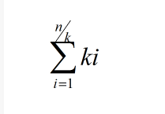

# MySTL

### This repo will accomplish some Simple STL Container, Algorithm and Iterator， Fuction object
[Reference](https://blog.csdn.net/TowerOs/article/details/103957395)

#### Container
#### Vector
3/1/2023
- [x] construct function of the vector
- [x] deconstruct function of the vector
- [x] copy construct function of the vector
- [x] member function: push_back
  the improvement of the push_back:  
Cumulative increase time complexity O(n) 
  
  Multiply increase time complexity O(1) 
    
  **my imporvemnet:**  
 the origin way to expansion is toExpanding the capacity by 2 times will cause the memory requested next time to be greater than the sum of the previously allocated memory, causing the previously allocated memory to no longer be used, so it is best to set the doubling growth factor between (1,2).
 I setting the 1.5 times of vector in my poject. 